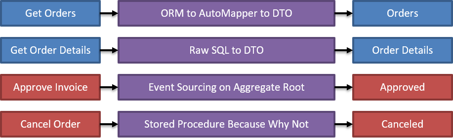

<p align="center">
  <a href="http://nestjs.com/" target="blank"></a>
</p>

[circleci-image]: https://img.shields.io/circleci/build/github/nestjs/nest/master?token=abc123def456
[circleci-url]: https://circleci.com/gh/nestjs/nest

  <p align="center">Nest TypeScript starter kit by AghnatHs</p>
    <p align="center">

## Description

[Nest](https://github.com/nestjs/nest) framework TypeScript core kit (mainly for personal use), with pre-configure TypeORM, Logger (Pino), ExceptionFilter, and Interceptor.

## Disclaimer

This project is an independent starter kit built on top of the NestJS framework. It is not officially affiliated with, endorsed by, or maintained by the NestJS team.

It is intended solely for my personal use to accelerate development by providing preconfigured modules such as logging, validation, and database integration.

Use at your own discretion.

## What already configured

- TypeORM (migrations included by command "npm run migration:\*")
- Logger (Pino) (log to console and files (daily rotation))
- ExceptionFilter (when response is error or HTTPException)
- Interceptor (when response is success)

- Centralized response using HTTPResponse class for consistency
- .env.\* (per development)

## How I structure the project

Inspired by DDD and Vertical Slice architecture for the project structure

- Domain → Domain models + domain services
- Features (UseCases) → API layer (Controllers) + application services (UseCases) + DTOs + validators
- Infrastructure → Anything related to infra (ORM, Logger, ExceptionFilter, Interceptor, Mail things, etc)
- Libs → reusable utils can be used by Domain or Features (no frameworks dependencies)
- Migrations → TypeORM migration 
- Types → mostly for extending Express.Request and Express.Response, but can be used for other shared types

<p align="center">
  
</p>

- Each feature have its own implementation (but not strictly "free form"); When there is a common logic between features, Refactor it into the domain entity or domain services.
- Refactor repeated logic into a rich Domain
- Refactor repeated domain-agnostic code into services, repositories
- Integration test the Use Cases
- Unit test the domain

from https://www.jimmybogard.com/vertical-slice-architecture/: </br>
"If your team does understand refactoring, and can recognize when to push complex logic into the domain, into what DDD services should have been, and is familiar other Fowler/Kerievsky refactoring techniques, you'll find this style of architecture able to scale far past the traditional layered/concentric architectures."

other references: </br>
- https://www.milanjovanovic.tech/blog/vertical-slice-architecture-where-does-the-shared-logic-live
- https://verticalslicearchitecture.com/learn/cookbook/history.html

## Project setup

```bash
use the template to create your own repository, with (Use this template) butotn

$ git clone https://github.com/your-username/your-repository.git .

$ cd your-repository

$ npm install

# setup .env.production, .env.development, and .env.test from .env.example
$ cp .env.example .env.production
$ cp .env.example .env.staging # optional in production environment
$ cp .env.example .env.development # optional in production environment
$ cp .env.example .env.test # optional in production environment

$ mkdir logs

$ npm run start:dev
```

## Migration

## Migration (Development)

Migration in development will use .env.development

```bash
# Apply all migration to database
$ npm run migration:run

# generate migration based on current entities (Linux / MacOs)
$ npm run migration:generate --name=CreateUsersTable
# generate migration based on current entities (Windows)
$ npm run migration:generate:win --name=CreateUsersTable

# create empty migration file (Linux / MacOs)
$ npm run migration:create --name=CustomMigration
# create empty migration file (Windows)
$ npm run migration:create:win --name=CustomMigration

# undo most recent migration
$ npm run migration:revert
```

- Never edit existing migration, create a new one instead
- On Windows, use the \*:win variants because environment variable syntax differs (%VAR% - $VAR).

## Migration (Production)

For running a newly migration in production using .env.production, just run this command

```bash
$ npm run migration:run:production
```

## Migration (Staging)

For running a newly migration in staging using .env.staging, just run this command

```bash
$ npm run migration:run:staging
```

## Migration (Using compiled js)

If you want to run migration using compiled javascript files on dist folder, you can use this command

```bash
$ npm run build

# For production, will use .env.production
$ NODE_ENV=production npm run migration:run:js

# For staging, will use .env.staging
$ NODE_ENV=staging npm run migration:run:js
```

## Compile and run the project

```bash
# development mode, will use .env.development
$ cp .env.example .env.development
$ npm run migration:run
$ npm run start:dev

# production mode, will use .env.production
$ cp .env.example .env.production
$ npm run build
$ npm run migration:run:production
$ npm run start:prod

# using docker (production)
$ cp .env.example .env
$ docker build --build-arg NODE_ENV=production -t nest-core-kit .
$ docker run -d -p 3000:3000 --env-file .env --name nest-core-kit-container nest-core-kit

# using docker (staging)
$ cp .env.example .env.staging
$ docker build --build-arg NODE_ENV=staging -t nest-core-kit:staging .
$ docker run -d -p 3000:3000 --env-file .env.staging --name nest-core-kit-staging nest-core-kit:staging
```

## Run tests

```bash
# unit tests
$ npm run test

# unit tests (verbose)
$ npm run test:verbose

# e2e tests
$ npm run test:e2e

# test coverage
$ npm run test:cov
```

## Deployment

TODO

## License

[MIT licensed](https://github.com/AghnatHs/nest-core-kit/blob/main/LICENSE).
